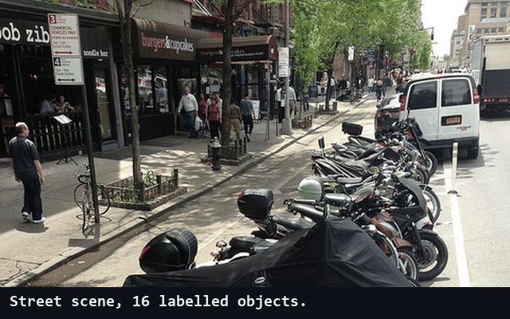

  

### Hi, I'm Nael 👋

ML engineer at Bosch, Stuttgart, with a systems engineering background. I managed
requirements on ADAS programs for 2.5 years. Now I build the models and test whether they
would pass that kind of review.

**A score tells you how good a model is. Its failures tell you whether you can ship it.**

- 🎯 **What I bring:** requirements discipline for ML. Every claim traced to a number, every number to a test.
- 🤖 **Building now:** LLM agents with verification built in: LangGraph multi-agent graphs, MCP tools, reviewer loops.
- 🔍 **How I work:** each project answers a question and shows where the model breaks, not just its best score.
- 🦾 **Roots:** robot arms, mobile robots, embedded motor control. I like software that has to work in the physical world.
- 🧭 **Interested in:** robotics, aerospace and defense.
- ⚡ **Fun fact:** my first agent wrote "360 small persons missed". The real number was 227.
  That one bug is why my agents now have a reviewer.

   
  YOLOv8n on a COCO street scene. Green: found. Red: missed. From <a href="https://github.com/knh4abt/perception-triage-agent">perception-triage-agent</a>.

### Projects

| Project | Question | Answer | Stack |
|---|---|---|---|
| [perception-triage-agent](https://github.com/knh4abt/perception-triage-agent) | Can an LLM agent correctly report where an object detector fails? | Only after 5 fixes. The more work I moved from the model to code, the more reliable the report got. | YOLOv8, LangGraph, MCP, Ollama, Docker |
| [driving-scene-segmentation](https://github.com/knh4abt/driving-scene-segmentation) | Where do DeepLabV3+ and SegFormer-B0 fail on Cityscapes? | 72.9% vs 60.1% mIoU. The gap is not noise: trucks get labelled as cars. | PyTorch, Hugging Face |
| [medvision](https://github.com/knh4abt/medvision) | How far does a small CNN get on colorectal histology? | EfficientNet-B0, 99.6% accuracy on NCT-CRC-HE-100K. | PyTorch, timm, Albumentations |
| [rul-for-nasa-jet-engines](https://github.com/knh4abt/rul-for-nasa-jet-engines) | How long until a jet engine fails? | Random Forest on NASA C-MAPSS, RMSE 46 (75% better than baseline). | scikit-learn, pandas |

### Toolbox

### Say hi

