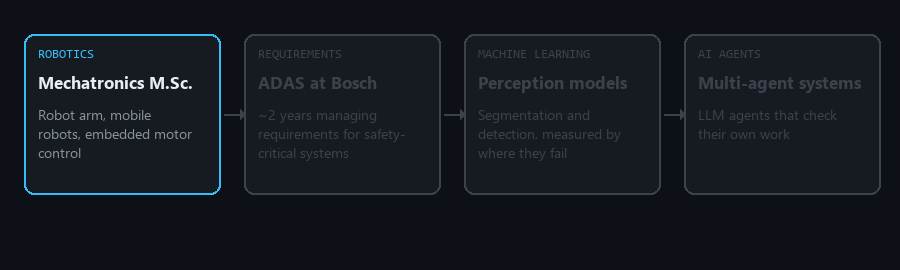
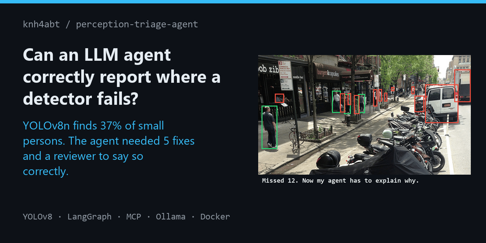
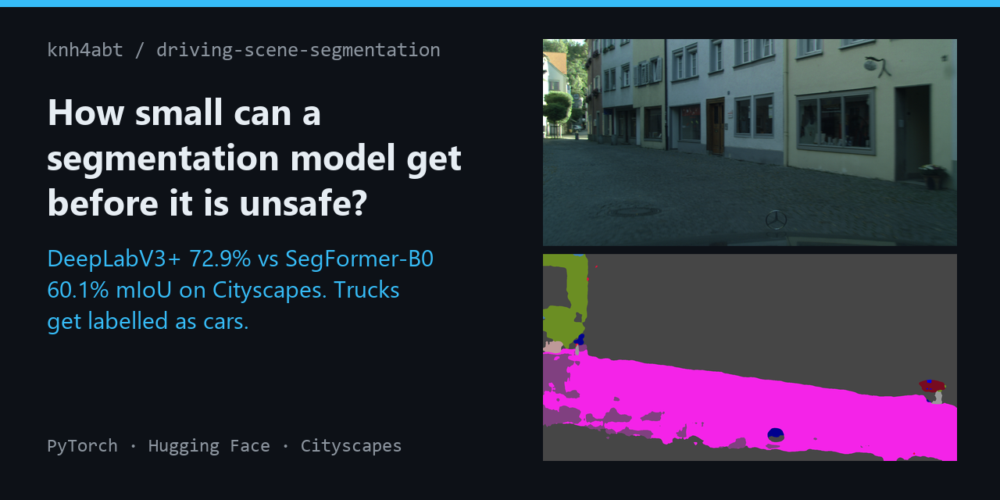
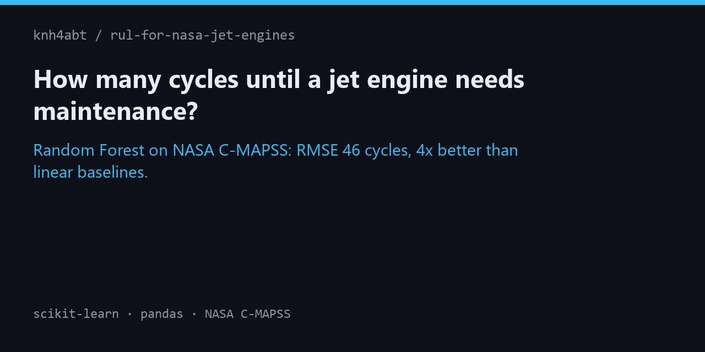
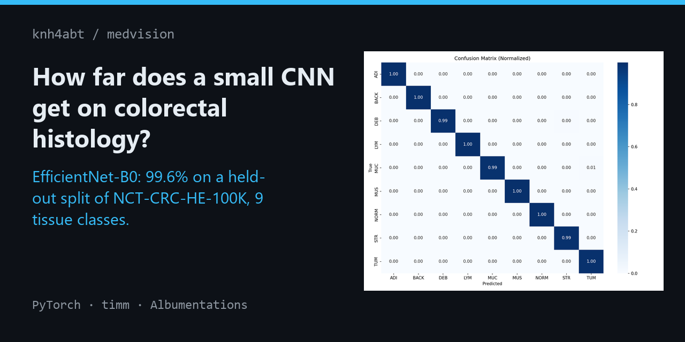

  

### Hi, I'm Nael 👋

Mechatronics engineer at Bosch, Stuttgart. I spent ~2 years managing requirements on ADAS
projects, and since 2025 I build ML models. I still test them the way I tested requirements:
every claim needs evidence.

**A score tells you how good a model is. Its failures tell you whether you can ship it.**

- 🔬 **Now:** in Bosch's AI research department, working on multi-agent systems.
- 🎯 **What I bring:** requirements discipline for ML: traceable results, tested pipelines, documented failure modes.
- 🤖 **Side projects:** LLM agents with verification built in: LangGraph multi-agent graphs, MCP tools, reviewer loops.
- 🔍 **How I work:** each project answers a question and shows where the model breaks, not just its best score.
- 🦾 **Roots:** robot arms, mobile robots, embedded motor control. I like software that has to work in the physical world.
- 🧭 **Open to:** AI and ML engineering roles in robotics, aerospace and defense.

  

### Projects

<table>
  <tr>
    <td width="50%"></td>
    <td width="50%"></td>
  </tr>
  <tr>
    <td width="50%"></td>
    <td width="50%"></td>
  </tr>
</table>

### Toolbox

  

  
  
  
  
  
  
   
  
  
  
  
  
  
  

### Say hi

  
  

